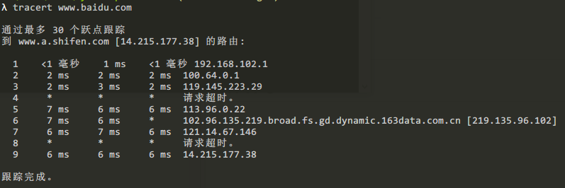
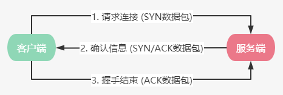
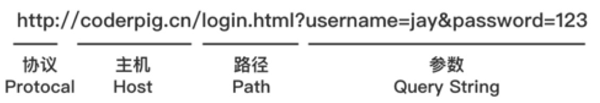

# HTTP与HTTPS协议概述

&nbsp;

## 简述一次网络请求

一个习以为常的操作：打开浏览器 → 输入网址 → 回车 → 等待网页加载结束 → 浏览网页<br>
问题：整个过程的背后都发生了什么？ 笔者以访问百度为例，输入域名回车后：

### 1、通过URL查找服务器IP

> 将域名解析为对应服务器的IP地址，如www.baidu.com，浏览器并不认识这个域名，拆解下：<br>
> www是`服务器名`，baidu是`公司名或私人名`，com是 `域名根服务器`<br>
> 浏览器先访问 `本地hosts` 文件，检查文件中是否有与域名匹配的ip地址，有直接访问IP对应服务器；<br>
> 没有则向 `上层DNS服务器询问`，如果没有，继续向上层服务器访问，直到DNS根服务器。

可以在cmd终端中使用 `tracert` 命令查看数据包发送到目标服务器经过的路由结点及延迟，示例如下：



Tips：可输入`tracert -? ` 查看此命令的详细用法信息~

### 2、三次握手建立TCP连接

获取服务器IP后，就是跟服务器建立连接连接了，如图：



> - 客户端发送一个带 SYN 标志的数据包给服务器；
> - 服务器接收后，回传一个带 SYN/ACK 标志的数据包表示信息确认；
> - 客户端回传一个带 ACK 标志的数据包，表示握手结束，连接建立成功；

### 3、发送HTTP请求

客户端与服务器建立连接后就可以发送 HTTP 请求了，浏览器除了会发送<br>
`请求行` 与 `请求头信息` 外，还会发送 `一个空行` 代表请求头消息发送结束；<br>
如果是 POST 提交，还会提交 `请求体`.

### 4、服务器响应请求

Web服务器解析用户请求，进行处理，尔后把处理结果组装成响应报文，返回给客户端。

### 5、浏览器解析HTML

浏览器解析服务器返回的HTML代码，并请求其中用到的css/js/图片等资源。

### 6、页面渲染后呈现给用户

渲染的顺序是从上往下的，下载与渲染同时进行，最后加载完成显示到浏览器上。

## URI、URL与URN


**URI**（Uniform Resource Identifier）**统一资源标志符**，用于标记一个网络资源，URL和URN的父类。<br>
**URL**（Uniform Resource Locator）**统一资源定位符**，用地址标记一个网络资源，强调的是给资源定位。 <br>
**URN**（Uniform Resource Name）**统一资源命名**，用特定命名空间的名字标识资源，强调的是给资源命名。<br>

举个简单例子以示区分：

> 你在某个技术沙龙上认识了一位大牛，他自称Java架构师，加了他还有，怎么备注呢？<br>
> 如果是 **URN → Java/架构师/X某**，只关心给他命名，而不指定如何定位； <br>
> 如果是 **URL → X厂://Java/架构师/X某**，除了命名，还指定了定位具体到哪家公司；<br>

### URI的组成

访问资源的命名机制 + 存放资源的主机名 + 资源本身的名称（路径标识，还是着重于强调资源）

### URL的组成

协议（服务方式）+ 存有该资源的主机IP（有时还包含端口号）+ 主机资源的具体地址（如目录，文件名等）

**Tips**：网络上的URN用得不多，几乎所有的URI都是URL，所以一般网络连接常称为URL。

## HTTP请求报文

**HTTP**，Hyper Text Transfer Protocol（超文本传输协议），用于万维网服务器传输<br>
超文本到本地浏览器的传送协议，基于TCP/IP通信协议来传递数据。<br>

**HTTP** 是无状态的，因此限制每次连接只处理一个请求，服务器在处理完客户端请求，<br>
并接收到客户端的应答后，即断开连接，这种方式的好处就是节省传输时间。

当然，如果想保持连接的话，可以在请求首部字段中添加请求头Connection: keep-alive，<br>
表明使用持久连接，或者通过Cookies这类方式间接的保存用户之前的HTTP通信状态。

客户端与服务器完成三次握手建立TCP连接后，开始发送HTTP请求，请求由下述四个部分组成：

### 1、请求行

由 `请求方法`、`URL` 和 `HTTP协议版本` 三个字段组成，使用空格进行分隔，访问百度请求行内容如下：

```
GET /index.php HTTP/1.1
```

依次讲解下三个字段，先是 HTTP协议版本：

> HTTP/1.1 → HTTP/主版本号.此版本号 → 常用的有 HTTP/1.0 与 HTTP/1.1

然后是URL构成示例：



最后是请求方法，HTTP 1.1中定义了八种请求方法，具体作用如下：

|请求方法|作用|
|:-:|:-|
|GET|请求指定页面，并返回页面内容|
|POST|一般用于提交表单或上传数据，数据被包含在请求体中|
|PUT|客户端向服务器发送数据取代指定文档内容|
|DELETE|请求服务器删除指定页面|
|HEAD|与GET类似，只是返回的响应无具体内容，一般用于获取报头|
|OPTIONS||
|||

### 2、请求头

### 3、空行

### 4、请求正文


## HTTP响应报文

## HTTPS
