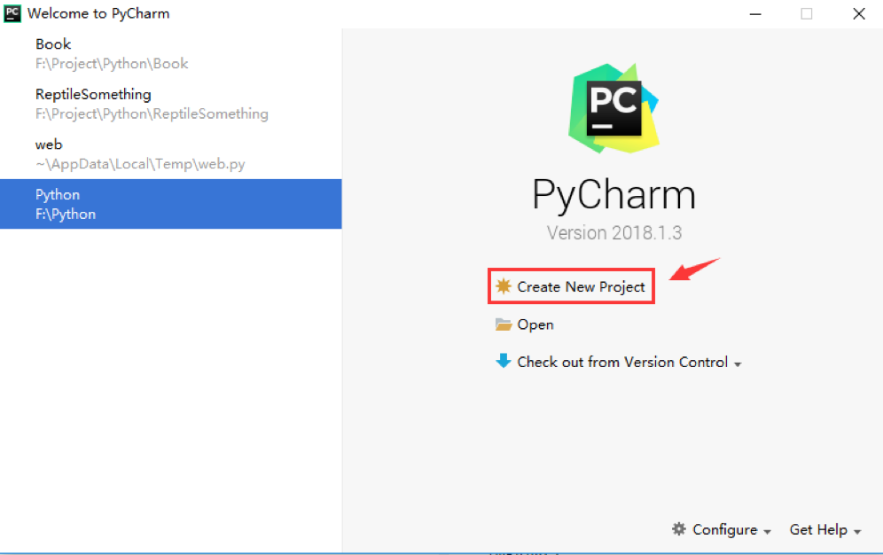

## Python开发IDE——PyCharm

本节概要：

- 为什么要使用IDE？
- PyCharm的下载安装
- PyCharm的基本使用
- PyCharm程序调试
- 共用全局的Python解释器


### 1、为什么要使用IDE？

----------

首先，什么是IDE？

> 
答：**IDE**（Integrated Development Environment）**集成开发环境**，用于提供程序开发环境的应用程序，一般包括代码编辑器、编译器、调试器和图形用户界面等工具。简单点说就是一个**开发工具包**。

其实，在安装完Python后，就可以直接进行Python开发，有下述两种方式：

> 
- 终端键入python，即可使用**`Python自带的IDLE`**进行开发；
- 使用Sublime Text 和 Notepad++这类**`代码编辑工具`**直接进行代码编写，编写完成后保存成后缀为**`.py`**的文件，接着命令行键入**`python xxx.py`**执行。

上面两种方式虽然可行，但是有些不方便，比如**代码缩进**问题。Python中通过代码缩进 来表示代码块，代码一多，如果某行没有正确缩进可能导致程序报错或结果与预期不符， 不好排查。一个好的 IDE可以给我们带来不少的便利，除了自动缩进，还有**智能提示补全**，**方便的依赖库管理**等功能，无疑可以提高我们写代码的效率。 

### 2、PyCharm的下载安装

----------

「**PyCharm**」，由**JetBrains**打造的一款Python IDE，除了可以执行py文件外，还支持**语法高亮**， 
**智能提示**，**代码跳转**，**依赖库管理**，方便快捷**切换不同python版本解释器**等强大功能。 PyCharm的**Community版免费**，基本够用，当然如果你愿意**付费**的话可以使用  **Professional**版。 打开官网地址进行下载，[https://www.jetbrains.com/pycharm/download/](https://www.jetbrains.com/pycharm/download/)，接着选择对应的系统，下载安装即可。 

### 3、PyCharm的基本使用

----------


### ① 创建项目


Welcome页点击「**Create New Project**」 打开项目创建窗口.



左侧提供了很多的模板工程，默认创建的是**Pure Python(纯Python)**，右侧选择工程保存的**路径和工程名**就好，下面的这个virtualenv上一节说到的虚拟环境，点击「**Create**」创建即可。 


![][3]

### ② 新建程序

点击工程，右键，点击「**New**」，然后点击「**Python File**」。

![][4]

在弹出的对话框中输入程序名，点击「**OK**」完成创建。 

![][5]

### ③ 编写程序

在左侧双击打开创建的test.py文件，在右侧即可进行代码编写，这里写了一个最简单的程序， 定义一个变量a，赋值1，然后把a打印出来!

![][6]

### ④ 运行程序

右键程序，找到：Run 'test'，即可运行程序，当然你也可以直接按快捷键。 

![][7]

运行后，底部会出现运行结果，比如这里的打印出a的值为1。 

![][8]

### ⑤ 错误定位

我们并不能保证我们的程序一定是正确的，有时可能会因为一些问题导致程序 运行停止，那就 需要我们定位到错误位置了，比如我们把**print(a)**改成**print(a/0)**， 故意引发除0错误。执行结果如下： 

```
F:\Project\Python\Test\venv\Scripts\python.exe F:/Project/
Traceback( most recent call last):
File "F:/Project/Python/Test/test.py",line 2, in <module>
print(a/0)
ZeroDivisionError:division by zero
```

点击test.py即可定位到错误位置，为第2行，然后进行修改即可。当然，只是这种显而易见的错误能够直接定位到，更复杂的错误就需要通过程序调试来定位了。  


## 4、PyCharm程序调试

一般的程序调试流程：「**下断点**」，「**单步调试**」，「**值跟踪**」

### ① 下断点

当**程序执行到断点所在的代码**时，会**暂停应用程序的运行**，**线程被挂起**，然后可以**通过调试器进行跟踪**。

下断点的方式也很简单，点击某行代码的左侧，会出现如图所示的小红点。

![][9]

这个小红点就是断点，在PyCharm中，有着各种类型的断点：

- **1. 行断点**

对「**`特定行进行调试`**」时用到，点击行所在的左侧边栏即可设置。 右键点击这个断点，会弹出如下所示的设置对话框：

![][10]

如果你取消了Enabled勾选，断点就处于如图所示的禁用状态：

![][11]

- **2. 方法断点**

把断点下到一个「**方法**」名前，一般用于检测方法的「**输入参数**」与「**返回值**」。比如：

![][12]

- **3. 变量断点**

有时我们对程序运行过程并不关心，而只「**关注某个变量的变化**」，可以在变量定义前加一个断点。比如：

![][13]

在程序运行过程中，如果该变量的值发生改变，程序会自动停下来，并定位到变量值改变的地方，供开发者调试。

- **4.条件断点（断点设置Condition）**

有时会有这样的场景：把断点打到循环体的中，我们只关心特定循环次数下的运行情况。 比如一个循环10次的循环体，我们想知道循环到第8次时的运行情况，如果你不知道条件断点的话，你需要一直按「**Run to Cursor**」直到满足我们的条件。比如下面的代码：

![][14]

使用条件断点的话，邮件断点，输入如下所示的「**等式条件**」：

![][15]

然后可以发现，程序直接跳到i=8的时候才挂起，非常方便。

![][16]

- **5.日志断点**

调试的时候我们可以通过打印日志的方式来定位异常代码大概位置，以缩小引发问题的范围，然后再使用断点精确定位问题。如果是普通的打印日志，我们需要等待重新构建程序，如果用「**日志断点**」就避免这个无意义的等待。使用日志断点非常简单，右键断点，去掉「**Suspend**」的勾选，会出现如下所示的弹窗，勾选「**Evaluate and log**」在此输入想输出的内容。

![][17]

运行调试后，当执行到日志断点的时候可以看到控制台输出了对应的日志信息，而且程序正常运行，并不会挂起。

![][18]

如果想查看更详细的信息，比如断点的位置和触发时的堆栈信息，可以勾选**「"Breakpint hit" message**」和「**Stacktrace**」，勾选后输出内容会变得更详细。

- **6. 临时断点**

所谓的临时断点就是：触发一次后就自动删除的断点。设置的方法有两种：

> 
- 1.光标移到想打点的行，点击菜单栏「**Run**」->「**Toggle Temporary Line Breakpoint**」， 等价于快捷键：「**Ctrl+Alt+Shift+F8**」
- 2.更便捷的操作：按住Alt，鼠标点击左侧边栏。

鼠标点击后可以去掉临时断点，如果想把临时断点变成普通断点，可以取消勾选「**Remove once hit**」的选项。

![][19]

- **7. 异常断点**

用于监听程序异常，一旦程序奔溃，直接定位到异常所在的确切位置。依次点击： 「**Run**」->「**View Breakpoints**」打开断点视图。点击「**+**」，然后选择 「**Python Exception Breakpoint**」，在弹出的窗口中输入要调试的异常：

![][20]

![][21]

除了设置异常断点外，你在这里看到项目设置的所有断点，并进行断点管理与配置。

### ② 调试工具详解

这里把调试工具划分为如图所示的五个区域一个个讲解：

![][22]

**A区（步进调试工具）**

|图标|名称|功能描述|
|-----|-----|-----|
|![][23]|Show Exception Point|**显示执行点**，定位到当前正在调试的断点。|
|![][24]|Step Over|**单步跳过**，遇到方法直接执行完方法，进入下一步，不会进入方法内部。|
|![][25]|Step Into|**单步进入**，遇到方法且是自定义的方法，则进入方法内部，否则不会进入。|
|![][26]|Step Into My Code|**单步进入**，进入自己编写的方法，不进入系统方法|
|![][27]|Force Step Into|无论是系统还是自定义的方法都会进入|
|![][28]|Step Out|**单步跳出**，跳出当前进入的方法，返回方法调用处的下一行（也意味着方法被执行完毕）。|
|![][29]|Force Run to Cursor|**执行到光标处**，可以看做临时断点，程序运行到当前光标所在行暂停|
|![][30]|Evaluate Expression|计算表达式，支持在调试过程中，通过赋值或表达式方式修改任意变量的值。|


**注意**：

> 上面的执行到光标处是有个前提的：中途没有断点，如果你想强制执行到 光标处的话，你需要「**Force Run to Cursor**」，你可以通过下述两种方式执行：
> 
1.光标处右键，选中「**Force Run to Cursor**」
> 
![][31]
>
2.使用快捷键：「**Ctrl + Alt + F9**」。

**B区（控制调试工具）**

|图标|名称|功能描述|
|-----|-----|-----|
|![][32]|**继续程序运行**|程序运行到某个断点暂停，如果有下一个断点，点击后跳到这个断点，没有的话，程序则继续运行。|
|![][33]|**暂停程序运行**|暂停程序运行|
|![][34]|**终止程序运行**|终止程序运行|
|![][35]|**查看断点**|可以查看所有的断点，管理与断点配置|
|![][36]|**禁用所有断点**|切换所有断点的状态（启用/禁用），禁用后，程序就不会触发断点。|
|![][37]|**恢复布局**|恢复到原始布局|
|![][38]|**设置**|调试的相关配置，比如是否显示执行方法后的返回值|
|![][39]|**固定或取消标签**|固定或取消标签|

**C区（帧调试窗口）**

这里的帧指的是：堆栈帧，一种用于「**存储数据**」和「**部分过程结果**」的数据结构；
每次调用方法在堆栈中都会占用一部分内存，单位是帧，随着方法调用而创建。
每个堆栈帧中包括了：「**传入参数**」、「**返回地址**」、「**局部变量**」以及「**对程序调试提供支持的信息**」。一个线程包括多个堆栈帧。


**D区（变量区）**

在这个区域可以看到堆栈帧中当前所有的数据（方法参数、本地变量、实例变量）。 右键某个变量，可以进行「**设置\复制变量值**」，「跳转到变量在代码中的位置」等操作。 一个常用的操作：选择「**Add to Watches**」，单独监视这个变量的变化。

**E区（监视窗口）**

除了前面这种右键添加监视的方法外，你还可以直接在E区点击「**+**」进行添加。

![][40]

不止监控变量，还支持监控表达式，比如上面的a+1，关于PyChram的调试基本知识点就这些，
更多的还需要读者自行到实战中巩固。

## 5、共用全局的Python解释器

PyCharm默认启用虚拟环境，每次创建项目，依赖到的模块都需要pip装一遍，有些繁琐。
其实可以让当前项目和全局的Python解释器共用。在创建项目的时候勾选：「**inherit global stie-packages**」即可，如图所示：

![][41]