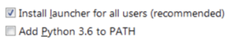
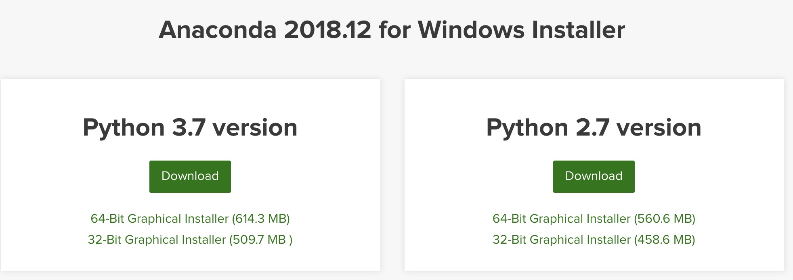

## Python开发环境搭建

本节概要：

- 选择 `Python2` 还是 `Python3`
- Python 开发环境的下载与安装


### 1.选择Python 2还是Python 3


> **Python 3** 在设计时并「**没有考虑向下兼容**」，即Python 2的Python程序在3.x的环境可能无法正常运行。<br>
> 最终的Python 2.7版本已于2010年发布，在此之后2.x也没有新的主要版本，而Python 3正处于活跃发展阶段，<br>
> Python 3.0发布于2008年，至今已经过了11年了，稳定版本已发布到3.8.5。 <br><br>
> 官网已确定 **Python 2**  将在 **2020年退休**，而且现在大部分的第三方库正在慢慢地兼容3.x版本，<br>如果没学过Python的话，建议直接上手3.x的语法。一个最直观的例子：<br>
> Python 3中无需担心Python 2中令人焦头烂额的「**中文乱码问题**」。<br><br>
> 另外官网有一篇关于使用Python2还是Python3进行开发的讲解，<br>
> 有兴趣可移步至: [https://wiki.python.org/moin/Python2orPython3](https://wiki.python.org/moin/Python2orPython3)


### 2.Python环境的下载与安装

根据自己电脑的实际情况，查看对应系统的安装方法走一遍即可。


----------

① **`Windows`**

**方法一：直接官网下载Python 3安装包**

**官网下载地址**：
[https://www.python.org/downloads/windows/](https://www.python.org/downloads/windows/)<br>
找到电脑系统对应的安装包进行下载，如下：

- **64位系统**：下载 **Windows x86-64 executable installer** 安装包
- **32位系统**：下载 **Windows x86 executable installer** 安装包

速度比较慢的话，可以使用迅雷这类下载软件进行下载，下载完后点击安装，<br>
傻瓜式的一直按下一步就好。当执行到下图这一步时，记得勾选下「**Add Python x.x to Path**」，<br>
勾选了，等下就不用另外去配置环境变量了。 




如果忘记了勾选也没什么，接着教下配置Python环境变量，**找到Python的安装目录**，比如笔者的：<br>`C:\Users\CoderPig\AppData\Local\Programs\Python\Python36`， CoderPig那里改成你的用户名即可。<br>
复制下，右键此电脑，依次：**打开系统属性** -> **高级** -> **环境变量**，在系统变量找到「**Path**」，<br>
**点击编辑** -> **新增**，粘贴复制的Python路径，点击确定。 打开「**命令行提示符**」，<br>
输入下述指令查看Python版本，以此验证环境变量是否配置成功： 

    C:\Users\CoderPig>python -V
	Python 3.7.6

如果输出结果是python不是外部命令之类的信息，则说明配置没有成功，一般是路径问题， 读者自行检查，修正下即可。 


**方法二：通过Anaconda安装**

**Anaconda** 提供了Python的数据科学计算环境，自带Python和常用的库，使用方便。<br>
**官网下载地址**：[https://www.anaconda.com/download/](https://www.anaconda.com/download/)
同样根据系统版本进行下载安装包。



同样傻瓜式下一步安装，在「**Advanced Options**」页面把两个选项都勾上。<br>
安装完后打开「**命令行提示符**」，键入**`conda list`** 即可查看已安装的库。


----------


### ② Mac

Mac除了可以使用上述两种方法进行安装外，还可以通过「**Homebrew**」进行安装。 <br>
HomeBrew是Mac OS平台下的，拥有安装、卸载、更新、搜索等很多实用功能的 「**软件包管理工具**」，<br>
使用起来非常方便，**Homebrew官网**：[https://brew.sh/index_zh-cn.html](https://brew.sh/index_zh-cn.html) ，安装Homebrew很简单，<br>
直接复制下述命令粘贴到终端运行即可： 

```
/usr/bin/ruby -e "$(curl -fsSL https://raw.githubusercontent.com/Homebrew/install/master/install)" 
```

安装过程中需要输入一次密码，安装完后，直接键入下属命令即可完成Python3的安装： 

```
brew install Python3
```

同样可以通过：**`python3 -V`**，验证Python是否安装成功，看到这里读者可能有些疑惑：

> 问：为什么这里使用的是python3而不是python？<br>
> 答：因为Mac默认内置了python2，所以如果你想使用`Python3`来执行py脚本，而非`Python2`，<br>
> 需要使用`python3`。当然，也可以通过设置别名的方式把 python指向python3：**`alias python=python3`**


----------


### ③ Ubuntu，Debian，Deepin

和Mac一样自带Python 2，千万别手多去卸载！！！直接通过「**apt-get**」命令直接安装：


	sudo apt-get update 

	# 安装一些基础库
	sudo apt-get install -y python3-dev build-essential libssl-dev libffi-dev libxml2 libxml2-dev libxslt1-dev zlib1g-dev libcurl4-openssl-dev
	# 安装Python 3
	sudo apt-get install -y python3


除此之外还可以通过源码安装，不过有些繁琐，**源码地址**：[https://www.python.org/ftp/python/](https://www.python.org/ftp/python/)<br>
接着依次键入相关命令：

	# 1.创建安装目录
	sudo mkdir /usr/local/python3
	
	# 2.下载安装包解压，并进入目录
	wget --no-check-certificate https://www.python.org/ftp/python/3.7.6/Python-3.7.6.tgz
	tar -xzvf Python-3.7.6.tgz
	cd Python-3.7.6
	
	# 3.编译安装
	sudo ./configure --prefix=/usr/local/python3
	sudo make
	sudo make install
	
	# 4.创建Python3 链接
	sudo ln -s /usr/local/python3/bin/python3 /usr/bin/python3

### ④ CentOS，Red Hat

直接通过「**yum**」命令安装即可：

	# 安装EPEL和IUS软件源
	sudo yum install -y epel-release -y
	sudo yum install -y https://centos7.iuscommunity.org/ius-release.rpm
	
	# 更新
	sudo yum update
	
	# 安装Python 3
	sudo yum install -y python36u python36u-libs python36u-devel python36u-pip

