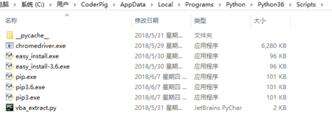

## pip包管理工具 & 虚拟环境

本节概要：

- `pip` 包管理工具
- 虚拟环境


### 1.pip包管理工具

----------

① **pip包管理工具简介与使用**

**`pip`** 是一个通用的「**Python包管理工具**」提供了对Python包的 「**查找**、**下载**、**安装**、**卸载**」功能。<br>
**Windows**下新版的Python安装包都是自带pip工具，pip的安装路径在Python安装目录下的**`Scripts`**文件夹下，<br>
比如笔者的电脑：



**Mac** 则在 **`/usr/local/bin/pip3`** 目录下，你还可以通过which命令进行查找：

	which pip3
	/usr/local/bin/pip3

**pip** 和 **python**一样，区分版本：**pip3** 和 **pip**，在终端键入pip后，回车，即可看到pip的详细用法：

	# 安装库(默认拉取最新版本安装，特定版本的话可以在后面加上=版本号)
	pip install 库名 
	
	# 卸载库
	pip uninstall 库名  
	
	# 查看库的详细信息，如果具体到有什么文件可以加上--files 
	pip show 库名 
	
	# 查看已安装的第三方库 
	pip list 
	
	# 检查有哪些可以更新的包 
	pip list --outdated 
	
	# 查看pip版本号 
	pip -V 
	
	# 更新pip
	pip install --upgrade 库名 


### 2. pip安装包慢的两种解决方法

----------

pip安装的包默认保存在：**`usr/local/lib/python版本号/dist-packages`** 路径下，<br>
你也可以通过 **`pip show`** 命令来查找。另外，因为pip安装使用的是国外的源，有时会很慢，<br>
可以直接使用国内镜像源来规避这个问题，比如： 

```
pip install –i https://pypi.tuna.tsinghua.edu.cn/simple requests
```

但是有些包，即使我们切换了国内的源，有时也可能出现下到一半不动或者报错，对于这种情况，<br>
可以把包先下载下来，然后使用pip命令进行「**本地安装**」。安装前，先确定电脑上的Python版本，<br>
直接在终端键入python查看，比如笔者的（**Python版本**：**3.7.0 win 32**）：


接着选择对应的「**whl文件**」进行下载：[http://www.lfd.uci.edu/~gohlke/pythonlibs/](http://www.lfd.uci.edu/~gohlke/pythonlibs/)，<br>比如pandas包：


下载安装后，直接通过pip本地安装即可，比如：

```
 pip install C:\Users\CoderPig\Downloads\pandas-0.24.2-cp37-cp37m-win32.whl
```

### 3. Ubuntu、Debian和Deepin安装pip

----------

不像Windows系统的Python安装包自带pip，上述这几个系统安装完Python后要另外安装pip，命令如下：

```
sudo apt-get install -y python3-pip
```

### 4. 虚拟环境

----------


所谓的虚拟环境，就是「**对开发环境进行隔离**」，用于解决这样的问题： 

> 
两个项目，一个基于Python 2.x的，另一个项目基于Python 3.x。 
又或者两个项目中的用到某个模块的版本不同，如何使得这两个项目互不干扰？ 

Python中使用了虚拟环境的概念，在虚拟环境中安装第三方库，只会作用到虚拟环境中，<br>
**全局的Python解释器不受影响**。 而在Python3中，虚拟环境已成为一个内置模块， <br>
创建一个带虚拟环境的示例如下： 

```
mkdir Test
cd Test
python -m venv venv
```

执行完上述命令后，Python会运行**`venv包`**，创建一个venv的虚拟环境，上面的两个venv参数依次为： 

- **Python虚拟环境包的名称**，固定写venv
- **应用于这个特定的虚拟环境的名称**，可以改成你喜欢的名字，不过笔者习惯命名为venv，切换到别的项目时，都能快速的找到对应的虚拟环境。

虚拟环境创建后，需要激活后才能进入，通过下述命令「**激活虚拟环境**」： 

```
source venv/bin/activate
```

复制代码执行完后会看到终端前缀多了个venv，激活虚拟环境后，终端会话的环境配置 就会被修改，此时键入Python或者pip，实际上调用的都是**虚拟环境中的Python解释器**。 

**一个常见的应用场景**

> **打开多个终端调试多个应用，每个终端窗口可以激活不同的虚拟环境，且不相互干扰**。

**注意**！！！

> 
如果你使用的是Python2或者Windows系统，如果想使用虚拟环境，要先通过pip命令安装先安装一波**`virtualenvwrapper`**：**`pip install virtualenvwrapper`**。然后创建虚拟环境：**`virtualenv venv`**，最后激活虚拟环境：**`venv\Scripts\activate.bat`**。